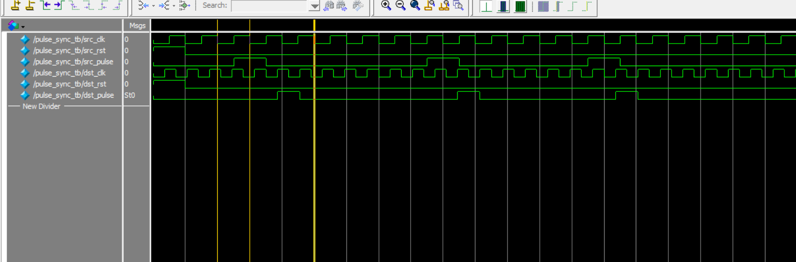

# ⏩ Pulse Synchronizer (CDC)

This project implements a **pulse synchronizer** in Verilog, transferring a short pulse from a source clock domain to a destination clock domain, avoiding metastability issues.

---

## 📁 Files Included

- `pulse_sync.v` — Verilog module for pulse synchronizer
- `pulse_sync_tb.v` — Testbench for simulation
- `pulse_sync.vcd` — VCD file for waveform viewing
- `monitor_log.txt` — Simulation output log (text format)
- `RTL_pulse_sync.pdf` — RTL schematic generated from Quartus
- `wave_pulse_sync_tb.png` — Waveform captured from ModelSim

---

## 🗺️ RTL Diagram

📄 [View RTL Diagram (PDF)](RTL_pulse_sync.pdf)

---

## 📷 Simulation Waveform



Waveform captured during simulation, showing **correct synchronization** of the input pulse across different clock domains.

---

## 🔥 Simulation Example (from `monitor_log.txt`)

```text
@ 10ns: src_pulse=1 -> dst_pulse=1
@ 20ns: src_pulse=0 -> dst_pulse=0
@ 130ns: src_pulse=1 -> dst_pulse=1
@ 140ns: src_pulse=0 -> dst_pulse=0
When a short pulse is generated in the source domain (src_pulse),
it is safely synchronized to the destination domain (dst_pulse).

Output dst_pulse remains active for one clock cycle of dst_clk.

🔧 Tools Used
ModelSim — For simulation and waveform visualization

Quartus Prime — RTL design and schematic generation

Verilog HDL — Hardware description language

✅ Result:
All logic was verified successfully in ModelSim simulation!
